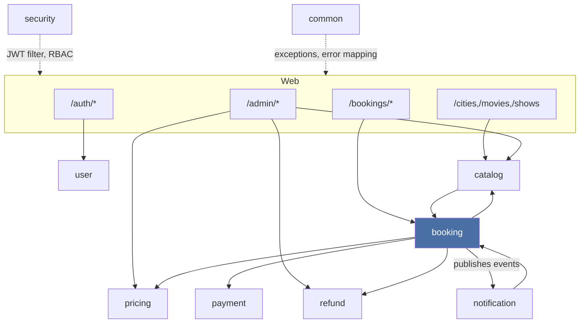
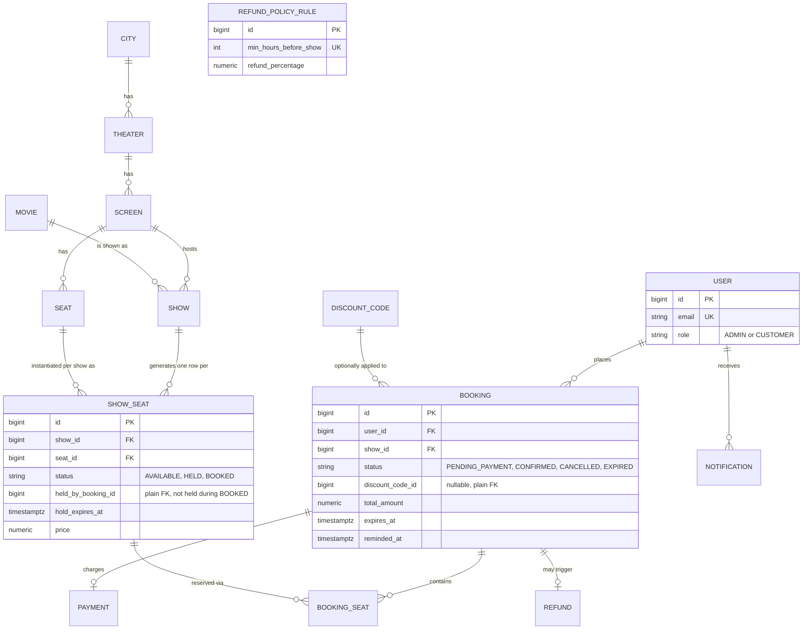
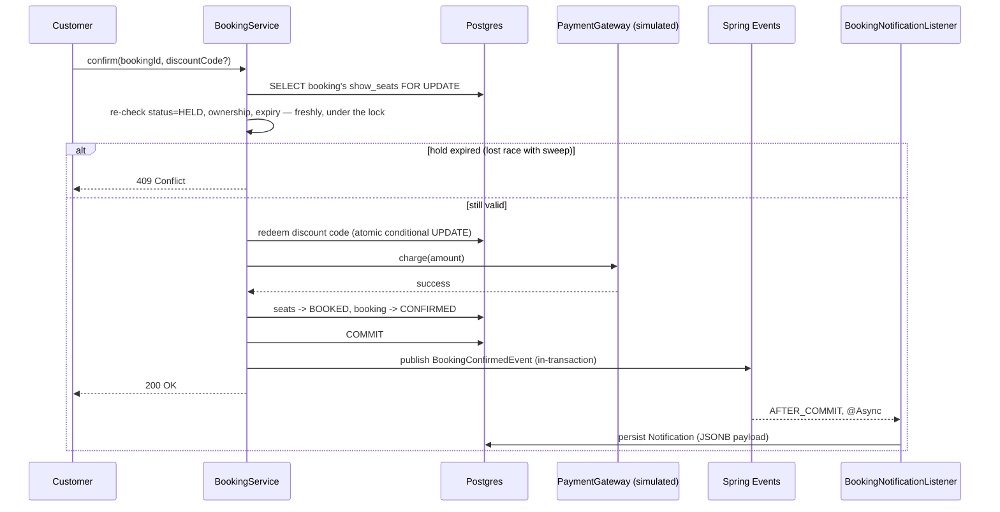
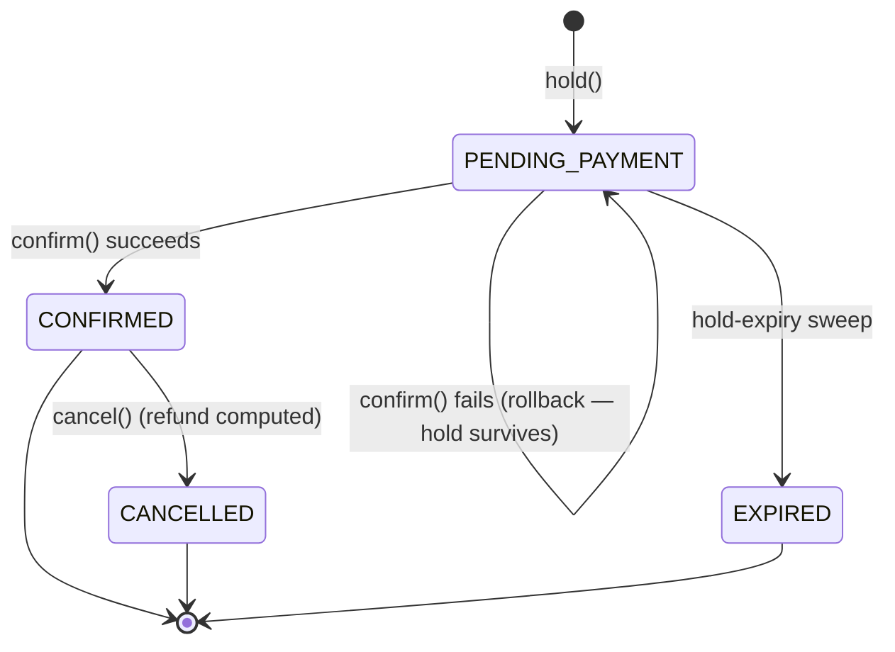
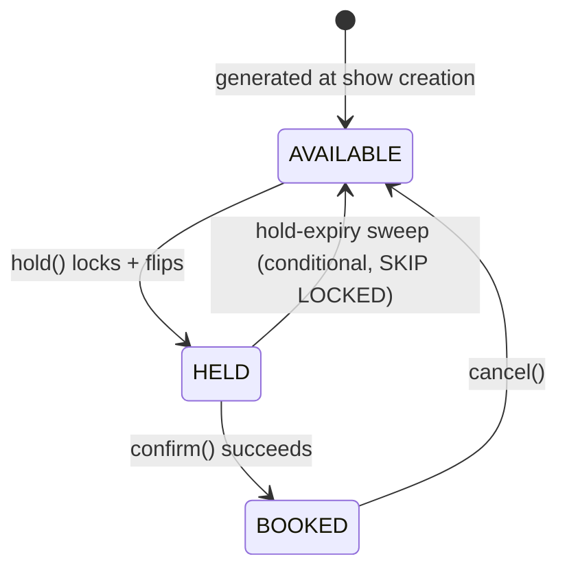

# Architecture

## Component overview

Package-by-feature ("modular monolith"), not package-by-layer — each business capability owns its
entities, repositories, services, and controllers. `booking` is the core module; `catalog` is
reference data; `pricing`/`payment`/`refund`/`notification` are supporting concerns the booking
flow orchestrates.



`catalog -> booking`: creating a `Show` (catalog) synchronously materializes its `ShowSeat`
inventory (booking) in the same transaction, via `ShowSeatGenerationService` — a show is never
visible without bookable seats. `notification -> booking`: the notification listener/reminder job
re-fetch booking data by id rather than the event carrying a full payload, keeping the event itself
minimal.

## Entity-relationship diagram



`ShowSeat` is the concurrency-critical table — every correctness argument below is about how its
rows get locked and conditionally updated.

## Concurrency design — the core of the evaluation

**Locking**: pessimistic `SELECT ... FOR UPDATE`, not optimistic (`@Version`). Optimistic locking's
conflict surfaces only at commit — after pricing/discount work has already run against stale data —
so under real hot-seat contention it produces a retry storm of wasted transactions. Row-level
locking serializes cleanly with no wasted work. `SERIALIZABLE` isolation is deliberately avoided:
`FOR UPDATE` under `READ COMMITTED` already gives the exact guarantee needed, and `SERIALIZABLE`
would add spurious `40001` retry-loop complexity for predicate conflicts this system doesn't have.

**Deadlock avoidance**: every query that locks multiple `ShowSeat` rows together orders them by id
*inside the SQL itself* (`ShowSeatRepository.lockByIdsForUpdate` / `lockByBookingIdForUpdate`) —
sorting ids in Java first would not guarantee lock-acquisition order, since `IN (...)` doesn't
preserve list order.

**Lock timeout**: `SET LOCAL lock_timeout` is applied before every locking read
(`BookingService.applyLockTimeout`, backed by `app.booking.lock-timeout-ms`), so a stuck or crashed
transaction can't block the connection pool forever. A timeout is translated to
`SeatLockTimeoutException` → 409, not a raw 500.

### Hold — `POST /bookings/hold`

```mermaid
sequenceDiagram
    participant A as Client A
    participant B as Client B
    participant Svc as BookingService
    participant DB as Postgres (show_seats)

    A->>Svc: hold(showId, [seat 42])
    Svc->>DB: BEGIN; SELECT seat 42 FOR UPDATE
    activate DB
    Note over DB: seat 42 locked by A's transaction
    B->>Svc: hold(showId, [seat 42])
    Svc->>DB: BEGIN; SELECT seat 42 FOR UPDATE
    Note over DB: B's transaction blocks — waits for A's lock
    Svc->>DB: A: seat AVAILABLE -> HELD, expiresAt=+5m
    Svc->>DB: COMMIT (A)
    deactivate DB
    DB-->>Svc: B's lock acquired, seat now HELD
    Svc-->>B: 409 Conflict — seat no longer available
    Svc-->>A: 200 OK — booking PENDING_PAYMENT
```

### Confirm — payment + async notification



`@TransactionalEventListener(phase = AFTER_COMMIT)` is what makes this safe: a plain
`@EventListener` fires synchronously at `publishEvent()` time, before the surrounding transaction
commits — if something downstream later rolled that transaction back, a "confirmed" notification
would already have gone out for a booking that never persisted. `@Async` keeps the notification
work off the request thread entirely.

### Booking lifecycle



### ShowSeat lifecycle



## The hold-expiry sweep and the reminder sweep

Both are `@Scheduled` jobs, no external scheduler/queue — staying consistent with "no distributed
systems." Both use the same two patterns:

1. **Claim-then-act via a conditional UPDATE.** The sweep's release only touches rows where
   `status='HELD' AND hold_expires_at < now()`; the reminder claim only touches rows where
   `reminded_at IS NULL`. Whichever transaction's conditional UPDATE actually matches a row wins the
   right to act on it — a losing transaction's UPDATE simply affects zero rows, a clean no-op
   rather than corrupted state. This is also what makes the sweep-vs-confirm race safe (see the
   third concurrency test): confirm re-checks status/expiry fresh under its own lock, so whichever
   of {confirm, sweep} gets there first "wins" and the other becomes a no-op.
2. **`FOR UPDATE SKIP LOCKED`, one booking per transaction** (`HoldExpiryReleaseService`). If any of
   a booking's seats are currently locked by another transaction (almost certainly an in-flight
   confirm), the sweep gets back fewer rows than expected and skips the *entire* booking this tick
   rather than releasing only part of a multi-seat hold — partial release would be a correctness
   bug, not a performance one.

### Horizontal scaling / multi-instance safety (e.g. Kubernetes replicas > 1)

This doesn't require any additional infrastructure to build or run — still one app, one database,
no broker — but the design is already safe if someone scales replicas, which is worth stating
explicitly rather than leaving implicit:

- **Seat-lock correctness is enforced by Postgres row locks, not application memory.** This is the
  concrete reason pessimistic DB locking was chosen over an in-process lock (`synchronized` /
  in-memory map) — an in-memory lock would silently break the moment there's more than one
  replica, since each pod has its own heap. A shared Postgres instance is the natural single
  source of truth for coordination here, without needing a separate distributed-lock service.
- **`@Scheduled` jobs get no leader election** — every replica runs its own timer independently.
  Both sweeps are safe under concurrent execution from multiple replicas for the same reason
  they're safe against a single confirm racing them: claim-then-act via a conditional UPDATE (plus
  `SKIP LOCKED` for the hold-expiry sweep) means redundant concurrent sweeps skip each other's
  in-flight bookings rather than double-processing them. This is why the reminder sweep's
  `remindedAt` claim exists — without it, N replicas independently scanning for
  due-for-a-reminder bookings would each send a duplicate reminder.
- **All lock-bearing writes assume a single primary Postgres instance** — no read-replica routing
  on the booking write path. True by default here (single instance, no replicas configured),
  stated as an explicit assumption for if this were ever split into a primary/replica topology.
