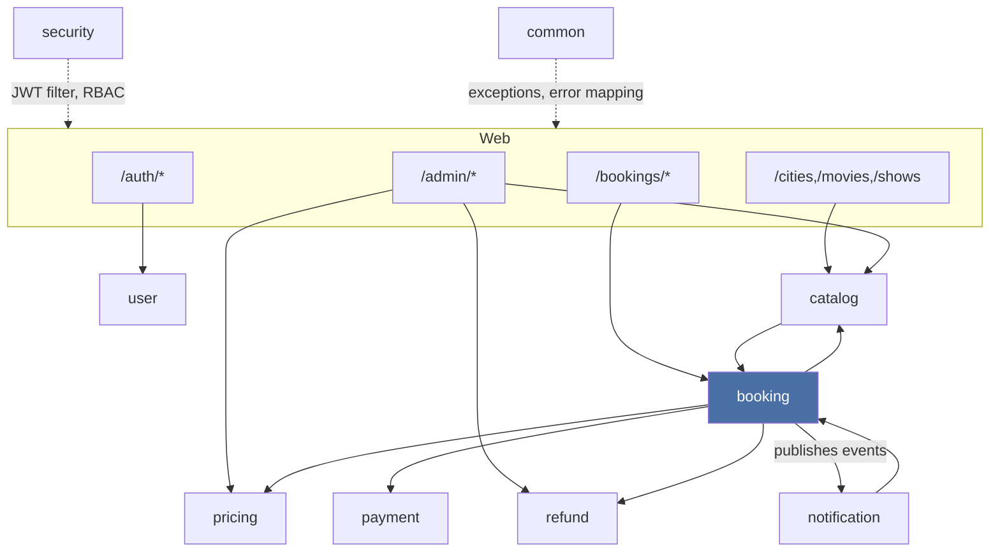
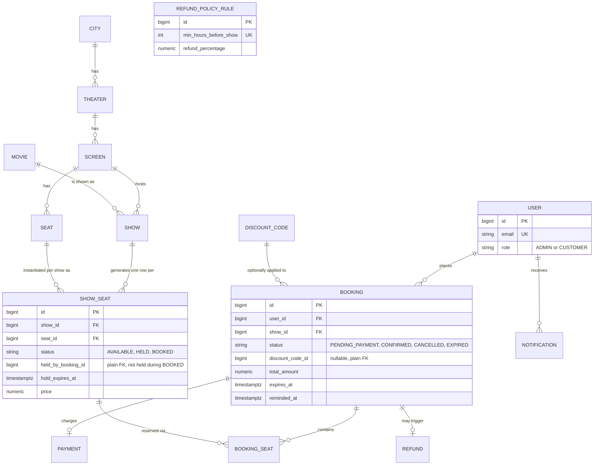
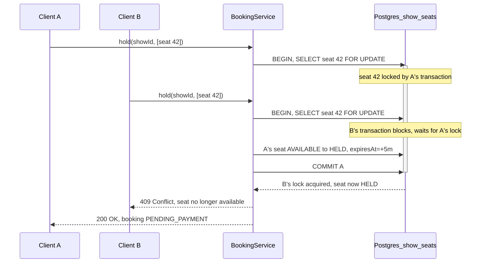
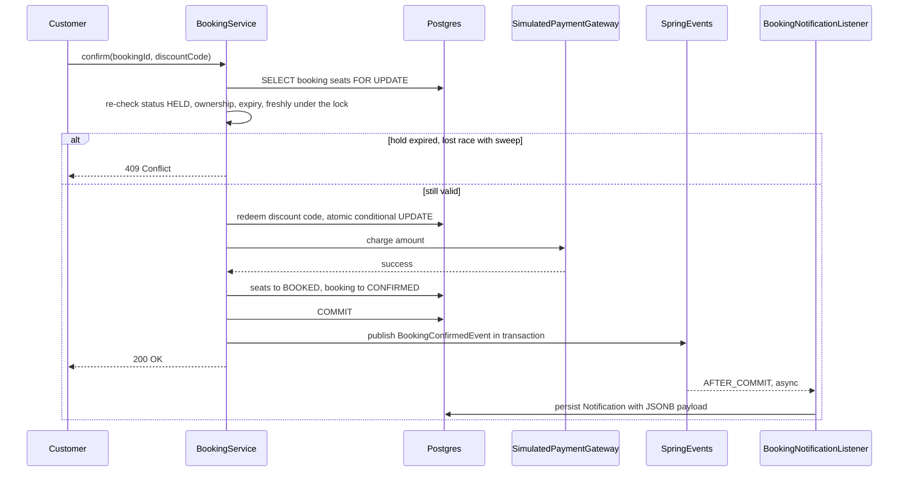
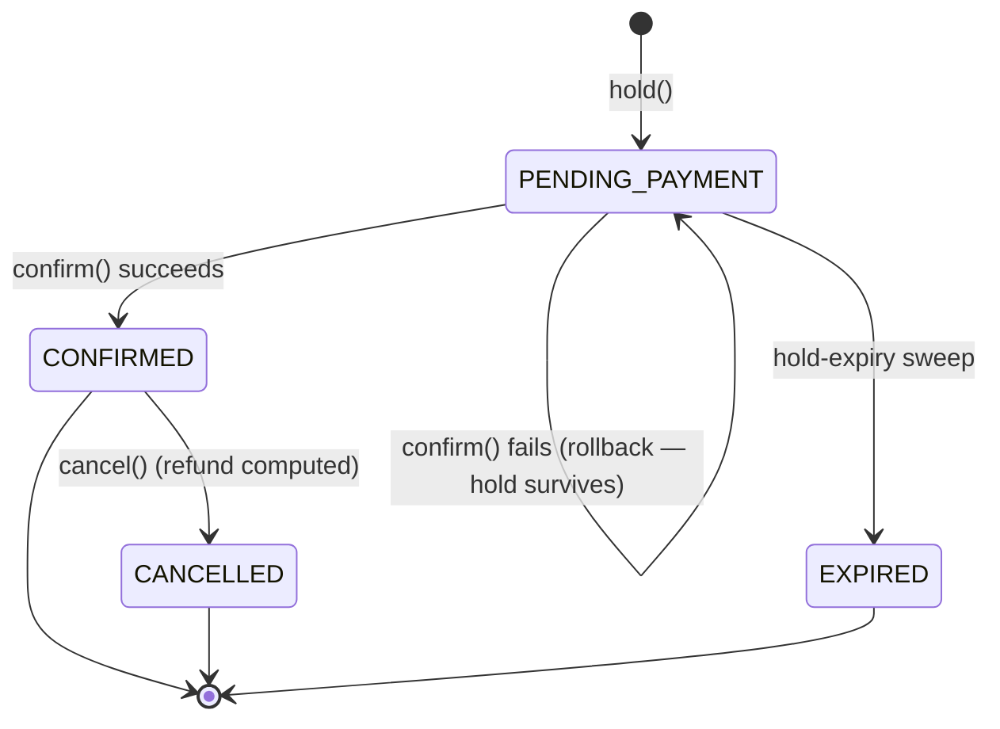
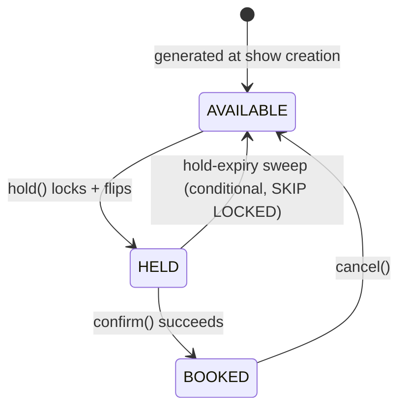

# Architecture

This is my design writeup for the movie ticket booking system — the diagrams and the reasoning
behind the decisions that I think actually matter for this assignment, mainly the concurrency
design. I've tried to write this the way I'd want to hand it to a teammate picking up the project
cold: not just what the code does, but why I built it this way instead of the alternatives.

## Component overview

I went with package-by-feature ("modular monolith"), not package-by-layer — each business
capability owns its entities, repositories, services, and controllers. `booking` is the core
module; `catalog` is reference data; `pricing`/`payment`/`refund`/`notification` are supporting
concerns the booking flow orchestrates.

`catalog -> booking`: creating a `Show` (catalog) synchronously materializes its `ShowSeat`
inventory (booking) in the same transaction, via `ShowSeatGenerationService` — a show is never
visible without bookable seats. `notification -> booking`: the notification listener/reminder job
re-fetch booking data by id rather than the event carrying a full payload, keeping the event itself
minimal.

## Entity-relationship diagram

`ShowSeat` is the concurrency-critical table — every correctness argument below is about how its
rows get locked and conditionally updated.

## Concurrency design — the core of the evaluation

**Locking**: I used pessimistic `SELECT ... FOR UPDATE`, not optimistic (`@Version`). I considered
optimistic locking first since it's the lower-friction default in most Spring apps, but its
conflict only surfaces at commit — after pricing/discount work has already run against stale data
— so under real hot-seat contention (a blockbuster's first show, 50 people clicking the same
front-row seat within a second) it produces a retry storm of wasted transactions instead of a
clean queue. Row-level locking serializes cleanly with no wasted work. I also deliberately did not
reach for `SERIALIZABLE` isolation as a "belt and suspenders" move — `FOR UPDATE` under
`READ COMMITTED` already gives the exact guarantee I need, and `SERIALIZABLE` would add `40001`
retry-loop complexity for predicate conflicts this system doesn't actually have.

**Deadlock avoidance**: every query that locks multiple `ShowSeat` rows together orders them by id
*inside the SQL itself* (`ShowSeatRepository.lockByIdsForUpdate` / `lockByBookingIdForUpdate`). I
initially assumed sorting the id list in Java before calling the repository would be enough to
guarantee lock-acquisition order — it isn't, because `IN (...)` doesn't preserve list order, so the
`ORDER BY` has to live in the query itself or the deadlock-avoidance guarantee is fake.

**Lock timeout**: `SET LOCAL lock_timeout` is applied before every locking read
(`BookingService.applyLockTimeout`, backed by `app.booking.lock-timeout-ms`), so a stuck or crashed
transaction can't block the connection pool forever. A timeout is translated to
`SeatLockTimeoutException` → 409, not a raw 500.

### Hold — `POST /bookings/hold`

### Confirm — payment + async notification

`@TransactionalEventListener(phase = AFTER_COMMIT)` is what makes this safe: a plain
`@EventListener` fires synchronously at `publishEvent()` time, before the surrounding transaction
commits — if something downstream later rolled that transaction back, a "confirmed" notification
would already have gone out for a booking that never persisted. `@Async` keeps the notification
work off the request thread entirely.

### Booking lifecycle

### ShowSeat lifecycle

## The hold-expiry sweep and the reminder sweep

Both are `@Scheduled` jobs, no external scheduler/queue — staying consistent with "no distributed
systems." Both use the same two patterns:

1. **Claim-then-act via a conditional UPDATE.** The sweep's release only touches rows where
   `status='HELD' AND hold_expires_at < now()`; the reminder claim only touches rows where
   `reminded_at IS NULL`. Whichever transaction's conditional UPDATE actually matches a row wins the
   right to act on it — a losing transaction's UPDATE simply affects zero rows, a clean no-op
   rather than corrupted state. This is also what makes the sweep-vs-confirm race safe: confirm
   re-checks status/expiry fresh under its own lock, so whichever of {confirm, sweep} gets there
   first "wins" and the other becomes a no-op (verified deterministically — sequencing rather than
   literally racing two threads — in `ConcurrentSeatBookingIntegrationTest`; see that test's own
   comment for why racing it on separate threads turned out to add flakiness, not rigor).
2. **`FOR UPDATE SKIP LOCKED`, one booking per transaction** (`HoldExpiryReleaseService`). If any of
   a booking's seats are currently locked by another transaction (almost certainly an in-flight
   confirm), the sweep gets back fewer rows than expected and skips the *entire* booking this tick
   rather than releasing only part of a multi-seat hold — partial release would be a correctness
   bug, not a performance one.

### Horizontal scaling / multi-instance safety (e.g. Kubernetes replicas > 1)

This doesn't require any additional infrastructure to build or run — still one app, one database,
no broker — but the design is already safe if someone scales replicas, which is worth stating
explicitly rather than leaving implicit:

- **Seat-lock correctness is enforced by Postgres row locks, not application memory.** This is the
  concrete reason pessimistic DB locking was chosen over an in-process lock (`synchronized` /
  in-memory map) — an in-memory lock would silently break the moment there's more than one
  replica, since each pod has its own heap. A shared Postgres instance is the natural single
  source of truth for coordination here, without needing a separate distributed-lock service.
- **`@Scheduled` jobs get no leader election** — every replica runs its own timer independently.
  Both sweeps are safe under concurrent execution from multiple replicas for the same reason
  they're safe against a single confirm racing them: claim-then-act via a conditional UPDATE (plus
  `SKIP LOCKED` for the hold-expiry sweep) means redundant concurrent sweeps skip each other's
  in-flight bookings rather than double-processing them. This is why the reminder sweep's
  `remindedAt` claim exists — without it, N replicas independently scanning for
  due-for-a-reminder bookings would each send a duplicate reminder.
- **All lock-bearing writes assume a single primary Postgres instance** — no read-replica routing
  on the booking write path. True by default here (single instance, no replicas configured),
  stated as an explicit assumption for if this were ever split into a primary/replica topology.

## Design patterns and SOLID — what I applied, and what I went back and fixed

I did a deliberate pass on this before calling the submission done, rather than assuming the
architecture was clean just because it compiled and the tests passed. A few patterns were already
there by construction; two things I found genuinely needed fixing, and I fixed them.

**Patterns already in use, and why I reached for them:**

- **Strategy, via an interface**: `PaymentGateway` is an interface with one production
  implementation (`SimulatedPaymentGateway`). `BookingService` depends on the interface, not the
  concrete class — which is the whole reason `PaymentFailureIntegrationTest` can substitute a
  failing implementation to test the declined-payment path without touching production code at
  all. If I ever wire in a real payment provider, it's a new class implementing the same
  interface, not a rewrite of `BookingService`.
- **Data-driven rules instead of conditional chains**: `RefundPolicyRule` and `PricingRule` are
  rows in a table, resolved with a query and a stream `filter`/`findFirst`, not an `if/else`
  ladder hardcoded in Java. Adding a new refund tier or a new seat-type price is an admin API call,
  not a code change and redeploy — this is the practical case for Open/Closed I actually had in
  this codebase, so I used it rather than reaching for a formal Strategy-pattern class hierarchy
  that would've been overkill for two config tables.
- **Domain events for cross-module side effects**: `BookingConfirmedEvent`/`BookingCancelledEvent`
  decouple the booking module from the notification module — `BookingService` doesn't know
  `BookingNotificationListener` exists. This is what let me put the notification write on
  `@TransactionalEventListener(phase = AFTER_COMMIT)` + `@Async` without touching booking code at
  all when I added notifications after the booking core was already working.
- **Repository pattern** (Spring Data JPA) keeps every module's persistence access behind an
  interface, and **builder pattern** (Lombok `@Builder`) on entities/DTOs keeps construction
  readable given how many fields some of these objects have (`ShowSeat`, `Booking`).

**What I found wrong and fixed (this was a real self-review, not a formality):**

- **SRP violation in the admin controllers.** `AdminCatalogController` had grown to 12 endpoints
  across five unrelated resources (cities, theaters, screens+seats, movies, shows) — a classic "one
  controller per module" shortcut that doesn't actually hold up, because changing how theaters are
  validated has nothing to do with how shows are created, and they had no business sharing a file.
  I split it into one controller per resource. Same issue, smaller scale, in
  `AdminPricingController` (pricing rules + discount codes bundled together) — split into
  `AdminPricingRuleController` and `AdminDiscountCodeController`.
- **SRP violation, one layer down.** `PricingService`, `DiscountService`, and `RefundService` each
  did double duty: domain logic (resolve a price, validate/apply/redeem a discount, calculate a
  refund) *and* admin CRUD (`findAll`/`create`/`update`/`delete`) for the same resource. Those are
  genuinely different reasons to change — a new discount *type* is a domain-logic change; a new
  *field* on the discount-code request DTO is an admin-API change — so I split each into a
  domain-logic service and a matching `*AdminService` (`PricingRuleAdminService`,
  `DiscountCodeAdminService`, `RefundPolicyAdminService`). `BookingService` and
  `ShowSeatGenerationService`, the actual consumers of the domain-logic side, didn't need to
  change at all — which is itself a decent signal the split was along the right seam.

I didn't split things that were borderline but still cohesive — `ScreenService` handles both
screen CRUD and seat-layout definition, but a screen's seat layout is intrinsically part of
managing that screen (you can't reasonably version them independently), so I left it as one class
rather than splitting for the sake of a rule.
